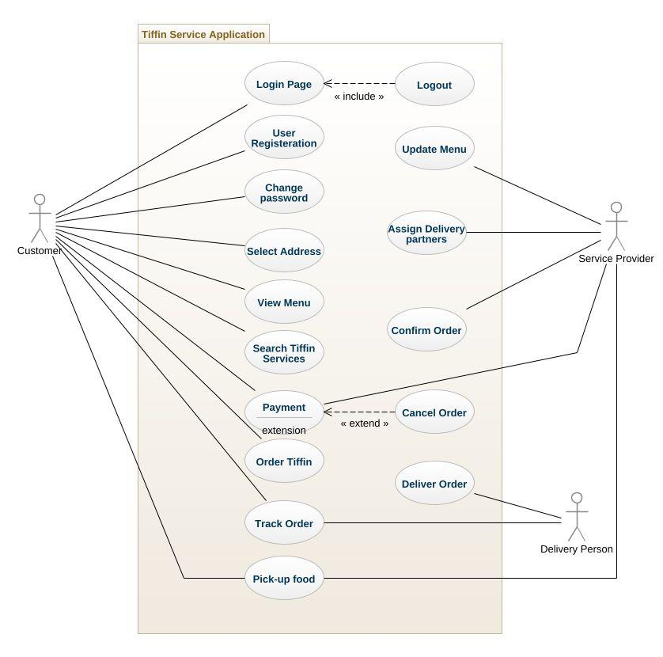
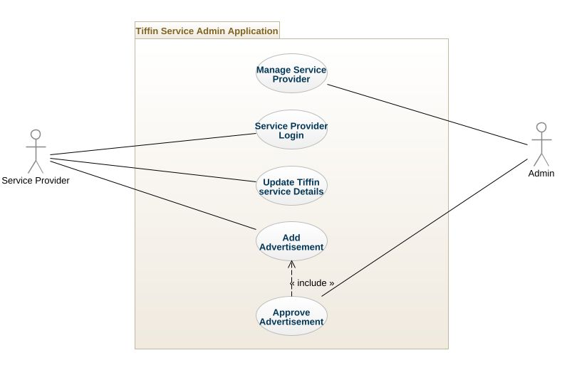
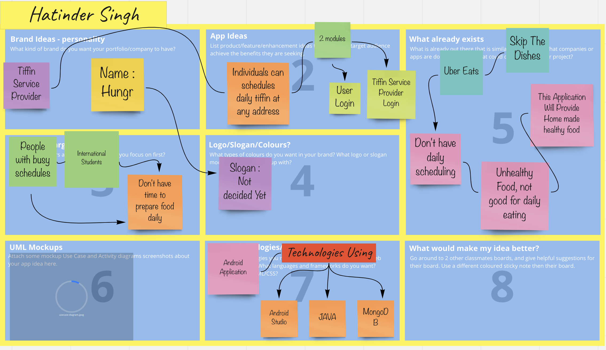

# Tiffin Service Application

### Collaborator
- Adithya
- Amandeep Singh
- Hatinder Singh
- Linto Varughese
- Nivedhiya Ponnuswamy

### Description
In the busy lifestyle, it is a difficult task to cook food at home for Canadians. The situation gets worse for the immigrants. By considering the same, we are presenting a tiffin service app that will allow the users to order the food of their choice from their favorite tiffin providers in the locality.  We will be providing the most needed platform which will connect users with various tiffin providers. We will add additional services for home delivery of selected food in the future. No more calling to tiffin service providers and waiting time.

### Use Case Diagram

### Admin Use Case Diagram

### Miro Board Screenshot

